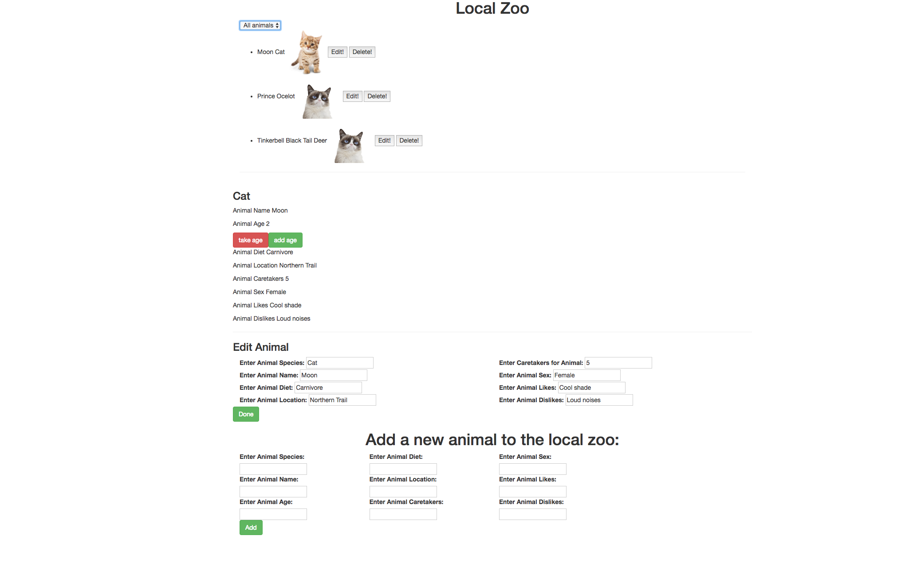

# _NG ZOO_

#### _Independent project implementing Angular 2 week 3_

#### By _**Javier Jimenez**_

## Description

_A web page where you can add new animals to the zoo and edit them_

## Specs

Home Screen

## Setup/Installation Requirements

* _Clone the repository [here](https://github.com/javierrcc522/ng-zoo.git)_
* _Open file in atom editor_
* _In terminal run 'npm install'_
* _In terminal run 'bower Install'_
* _In terminal run 'gulp build'_
* _In terminal run 'gulp serve'_
* _Use page in browser_

## Support and contact details

_If you have any comments or suggestions please make a contribution to my repository_

### License

*This project is licensed under the MIT license*

Copyright (c) 2017 **_Javier Jimenez_**
